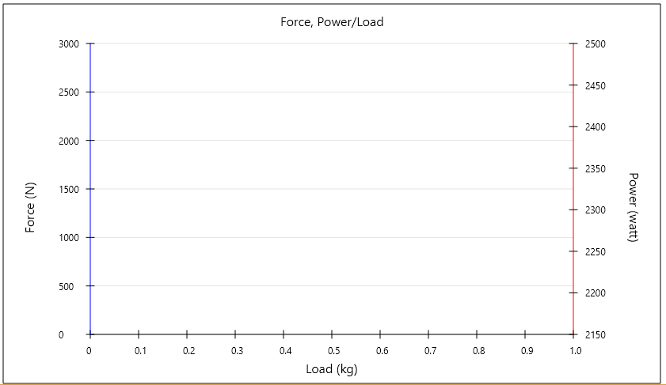
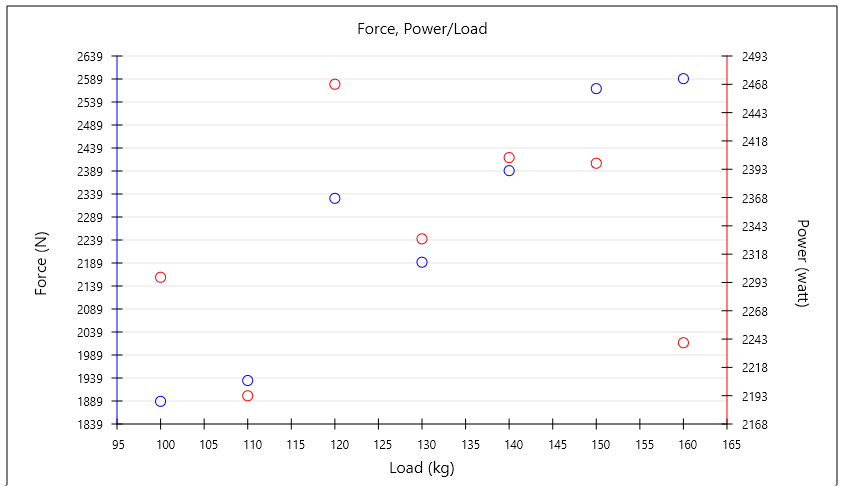

## MulitAxisScatterChart

Implementation of 2 Y-Axis Scatter Chart in pure JavaFX. This project was created due to lack of JavaFX default charts to represend data in multiple Y Axis.

Additional Functionalities :
Display Polynomial or Linear regression (TrendLines). ( Using <url>http://thorwin.nl/</url> for calculating line/curves coefficients )


## Code Example

Creating a new chart :

```java
// new CustomAxis(minValue, maxValue, tickValue)
CustomAxis xAxis = new CustomAxis(0, 1, 0.1);
xAxis.setTitle("Load (kg)");

CustomAxis y1Axis = new CustomAxis(0, 3000, 500);
y1Axis.setTitle("Force (N)");

CustomAxis y2Axis = new CustomAxis(2150, 2500, 50);
y2Axis.setTitle("Power (watt)");

// new MultiAxisScatterChart(width, height , . . . );
MultiAxisScatterChart chart = new MultiAxisScatterChart(850, 500, xAxis, y1Axis, y2Axis);
chart.setTitle("Force, Power/Load");
```




Adding value on chart :

```java

// addValue arguments (xValue , yValue, axisIndex)

// Adding value on chart on Second Y Axis
chart.addValue(100, 1889,MultiAxisScatterChart.FIRST_Y_AXIS);
chart.addValue(110, 1935,MultiAxisScatterChart.FIRST_Y_AXIS);
chart.addValue(120, 2337,MultiAxisScatterChart.FIRST_Y_AXIS);
chart.addValue(130, 2196,MultiAxisScatterChart.FIRST_Y_AXIS);
chart.addValue(140, 2398,MultiAxisScatterChart.FIRST_Y_AXIS);
chart.addValue(150, 2579,MultiAxisScatterChart.FIRST_Y_AXIS);
chart.addValue(160, 2601,MultiAxisScatterChart.FIRST_Y_AXIS);

// Adding value on chart on Second Y Axis
chart.addValue(100, 2298,MultiAxisScatterChart.SECOND_Y_AXIS);
chart.addValue(110, 2193,MultiAxisScatterChart.SECOND_Y_AXIS);
chart.addValue(120, 2469,MultiAxisScatterChart.SECOND_Y_AXIS);
chart.addValue(130, 2332,MultiAxisScatterChart.SECOND_Y_AXIS);
chart.addValue(140, 2404,MultiAxisScatterChart.SECOND_Y_AXIS);
chart.addValue(150, 2399,MultiAxisScatterChart.SECOND_Y_AXIS);
chart.addValue(160, 2240,MultiAxisScatterChart.SECOND_Y_AXIS);
```




Display Polynomial or Linear regression. By default regressions are not activated.

```java
chart.showLinearTrendLineOnAxis(MultiAxisScatterChart.FIRST_Y_AXIS);
chart.showPolynomialTrendLineOnAxis(MultiAxisScatterChart.SECOND_Y_AXIS);
```


Licence
-------
[GNU GENERAL PUBLIC LICENSE](LICENSE)
